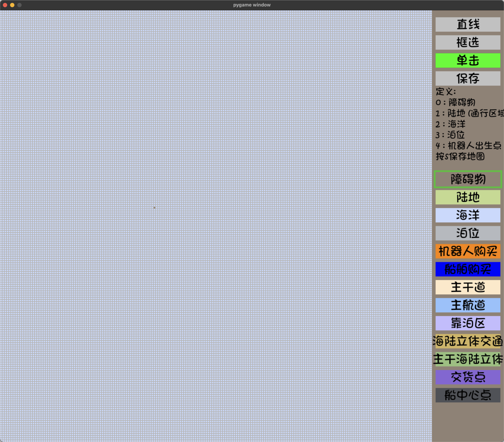

# 华为软件精英挑战赛 2024 江山赛区 年年旅游嘎嘎开心

## 亮点：
### 基于 pygame 的 replayer
我们基于 pygame 写了一套播放器，支持 0.25~16x的倍速，支持任意帧的跳转，支持机器人路径的显示，支持标注机器人状态，支持暂停时前后帧的移动


### 基于 pygame 的地图编辑器
我们基于 pygame 写了一套地图编辑器，可以支持从一个地图文件打开进行编辑，支持单点修改和区间修改


### 多环境的测试脚本
我们的`run.py`支持在 Windows、linux、mac 上执行同样的运行测试逻辑，并支持各种细节的参数。
`upload.py`支持在 Windows、linux、mac 上执行同样的打包逻辑，并按照时间戳命名，并自动将旧的压缩包移动到 OldFile 中备份。

### 多线程 logger
为了不影响 logger 对实际运行速度的影响，我们写了一套多线程的 logger 用来将中间日志输出到文件中。

为了更好的编写 log，我们加入了c++20中的 format 函数。得益于编译选项，所有的测试部分都只会在-DDEBUG 下运行。

### 高效的寻路和避障
我们基于 bitset 设计了一个极快的 BFS，可以在0.2ms 实现从一个点到全图的 BFS，并记录下每个点到 BFS 起始点的最短路。同时我们实现了一个基于紧密度的避障思路，这个思路可以基于 bitset 实现的寻路算法实现 O1 的避障，并保证最优的。

我们同时还实现了一套极快的基于时空 A* 的路径规划算法，可以实现机器人在规划完路径后绝不跳帧。

船的寻路我们将地图中每个点抽象成了四个点，BFS 过程中我们每一步的合理操作位：左旋、右旋、直行。

经过我们测试即使一百个机器人也可以正常运行。

### 生成货物的估计和地图区域的判断
我们基于概率估算了一个港口会独占的一片区域（并在 replayer 中有所展示），并根据独占区域去自适应购买机器人和分配机器人绑定的港口信息。

对于海洋的板块，我们对船购买点-泊位-销售点-船构建了一个连通块和参数排序，用于自适应购买船。

## 文件结构
- allMaps: 存储地图文件
- code：代码文件
- tools：可视化、编译、upload等工具
- refCode：可参考的无关代码文件
- dcode：本地增加了对c++20 std::format的支持，用在存放链接库

## Python Env:
tools 中的文件全部基于 python 编写
```
conda create -n cc24 python=3.7.3
conda activate cc24
pip install numpy==1.19.4 matplotlib tqdm opencv-python pygame 
```
## 代码结构
`berth.hpp`: 所有泊位的控制代码

`ship.hpp`: 所有船的控制代码

`robot.hpp`: 所有机器人的控制代码

`berth_center.hpp`: 调度中心，控制所有的泊位，船，机器人的策略

`config.hpp`: 所有的配置参数，高精度Timer的实现，不定长参数bugs的实现

`count.hpp`: 统计所有的信息，例如货物信息

`logger.hpp`: 一个多线程的 log 记录，会由额外的线程写入到相关文件里

### 测试工具

`upload.py`：用于提交代码

`tune.py`：用于调参

`run.py`：用于在不同环境下测试代码，并进行数据分析

`analysis.py`：对运行数据（例如时间，剩余货物等）进行分析

`Replayer_pygame_fast.py`：基于 pygame 的播放器

`MapEditor_pygame.py`：基于 pygame 的地图编辑器
